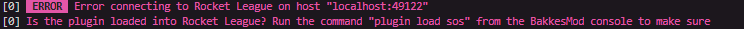
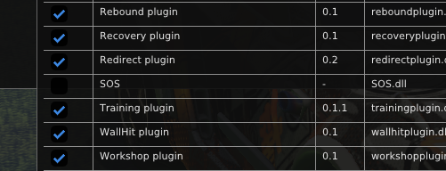

# 🧩 SOS Plugin + Overlay para Rocket League

Este proyecto integra un plugin(codeado por gboddin y modificado por SimpleAOB) para Bakkesmod con un overlay visual (Creado por Danielu) en Node.js, diseñado para mejorar tu experiencia de juego en Rocket League en la Semana FIIS-UNI. A continuación, se detalla el proceso de instalación paso a paso.

---

## 📋 Requisitos

- [Rocket League](https://www.rocketleague.com/es-es/)
- [Bakkesmod](https://www.bakkesmod.com/)  
- [Node.js](https://nodejs.org/es/download)

---

## 🚀 Instalación del Plugin

1. Clona o descarga este repositorio:  
```bash
   git clone https://github.com/tu-usuario/SOS-Plugin-bakkes.git
   ```
2. Descomprime el archivo 'SOS-Plugin-bakkes.zip'
3. Ubica el directorio de plugins de Bakkesmod
- Por defecto se encuentra en:
```
   C:\Users\YourUser\AppData\Roaming\bakkesmod\bakkesmod\plugins
   ```
4. Copia los archivos del plugin
- Mueve el contenido de la carpeta Plugins descomprimida al directorio mencionado.


## 🖥️ Instalación del Overlay
1. Abre o navega hacia la carpeta overlay-demo con tu IDE favorito
- Se recomienda Visual Studio Code.
- Para navegar : 
```PowerShell
cd overlay-demo 
```
2. Instala las dependencias del proyecto
```PowerShell
npm install
```
3. Ejecuta el overlay
```PowerShell
npm start
```
4. Verifica el funcionamiento
- Aparecerá el siguiente error:

```
ERROR  Error connecting to Rocket League on host "localhost:49122"
Is the plugin loaded into Rocket League? Run the command "plugin load sos" from the BakkesMod console to make sure.
```
- Este mensaje indica que el overlay esta funcionando correrctamente.
## 🎮 Activación del Plugin en Bakkesmod
1. Abre bakkesmod
2. Abre Rocket League
### Opciones de activación:
- Uso puntual del overlay: Presiona F6 dentro de Rocket League y escribe el siguiente comando en la consola del bakkesmod:
```
plugin load sos
```
- Uso frecuente del overlay: Presiona F2 dentro de rocket league -> Pestaña Plugins -> Plugin Manager(beta) -> Open PluginManager. Activa el checkbox del plugin SOS.

